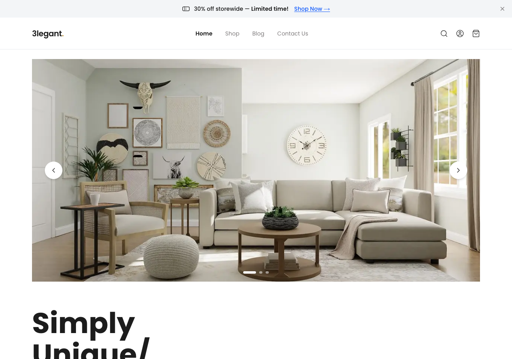
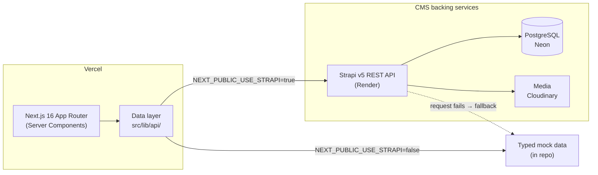
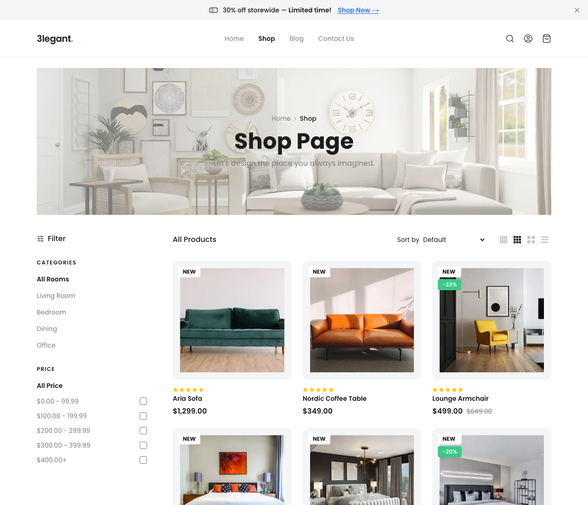
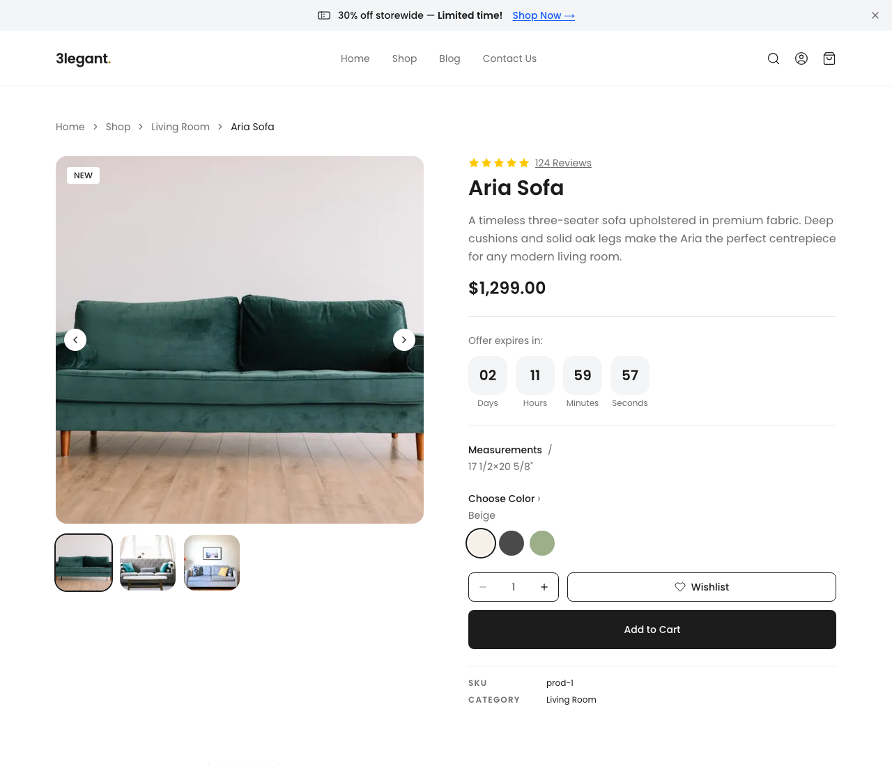
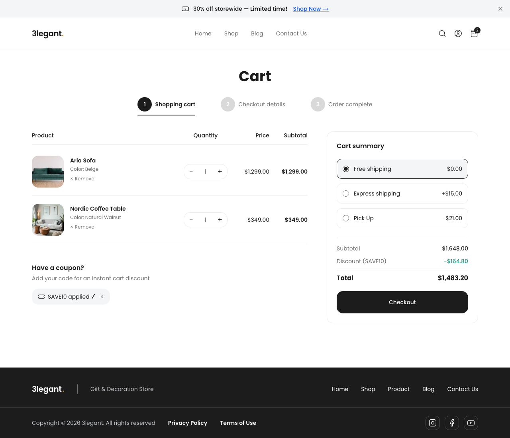
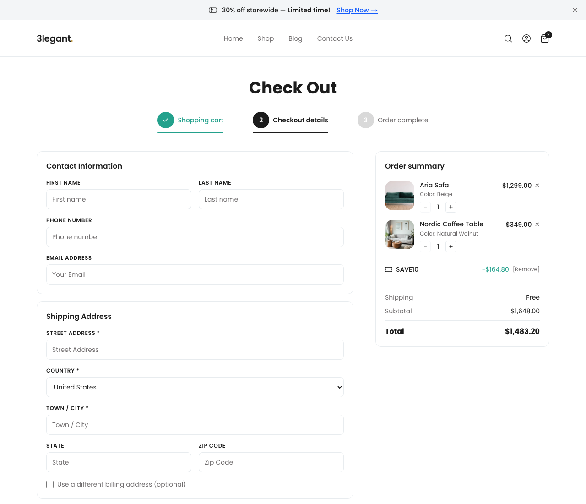
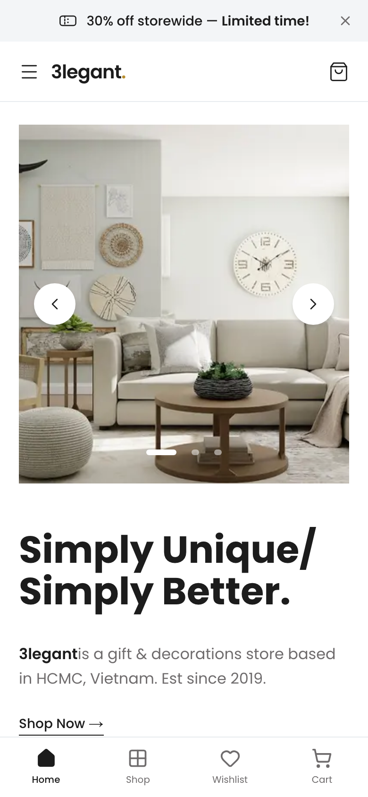

# 3legant Furniture Store

[](https://github.com/ngohuynhducdev/ecommerce/actions/workflows/ci.yml)

**🔗 Live demo: [ecommerce-dexr.vercel.app](https://ecommerce-dexr.vercel.app)**

A full-featured e-commerce storefront for a minimalist furniture brand, built with Next.js 16 App Router. Based on the [3legant Figma community design](https://www.figma.com/design/4wdIrC2NdJVK6VVFuWxtX7/).

> The live demo is served from the Strapi CMS (`NEXT_PUBLIC_USE_STRAPI=true`), with product content in Postgres and media on Cloudinary. Sign in with any email + a 6+ character password; card payments are simulated.



## Tech Stack

| Layer | Technology |
|---|---|
| Framework | Next.js 16 (App Router, Turbopack) |
| Language | TypeScript (strict mode) |
| Styling | Tailwind CSS v4 + shadcn/ui |
| State | Jotai + `atomWithStorage` (persisted to localStorage) |
| Forms | React Hook Form + Zod |
| Auth | NextAuth v5 (Credentials, mock authorize) |
| CMS | Strapi v5 (toggled via `NEXT_PUBLIC_USE_STRAPI`) |
| Font | Poppins (Google Fonts) |

## Getting Started

```bash
# Install dependencies
yarn install

# Start the development server
yarn dev
```

Open [http://localhost:3000](http://localhost:3000) in your browser.

## Environment Variables

Create a `.env.local` file in the project root:

```env
# Auth (required)
AUTH_SECRET=your-secret-here

# Strapi CMS (optional — defaults to mock data)
NEXT_PUBLIC_USE_STRAPI=false
NEXT_PUBLIC_STRAPI_URL=http://localhost:1337
STRAPI_API_TOKEN=

```

Generate `AUTH_SECRET` with:

```bash
openssl rand -hex 32
```

## Project Structure

```
src/
├── app/                  # Next.js App Router pages
│   ├── page.tsx          # Homepage
│   ├── shop/             # Shop listing + product detail
│   ├── cart/             # Cart page
│   ├── checkout/         # Multi-step checkout (3 steps)
│   ├── order-success/    # Order confirmation
│   ├── account/          # Profile, orders, wishlist (protected)
│   ├── auth/             # Sign in / Sign up
│   ├── blog/             # Blog listing + post detail
│   └── contact/          # Contact page
├── features/
│   ├── products/         # ProductCard, ImageGallery, FilterSidebar, types, mock data
│   ├── cart/             # CartFlyout, atoms
│   ├── wishlist/         # atoms
│   ├── checkout/         # multi-step form, atoms
│   ├── blog/             # BlogCard, BlogContent, TableOfContents, ShareButtons, mock data
│   ├── contact/          # ContactForm
│   ├── account/          # AccountSidebar
│   └── shared/           # Navbar, Footer, Breadcrumb, AnnouncementBar
└── lib/
    ├── api/              # products.ts, categories.ts, blog.ts (Strapi-ready)
    └── utils.ts          # cn(), formatPrice(), generateOrderId()
```

## Features

- **Shop** — product grid with filter sidebar (category, price range, color, material, rating), URL-param filters, sort, load more
- **Product Detail** — image gallery with thumbnails, variant selector, quantity picker, Add to Cart, wishlist toggle, related products, tabbed reviews
- **Cart** — quantity controls, coupon codes (`SAVE10`, `FURNITURE20`), order summary, persistent via localStorage
- **Checkout** — 3-step flow: shipping → payment → review → animated order success page
- **Auth** — NextAuth v5 with a Credentials provider whose `authorize` accepts any email + password ≥ 6 chars (no user store, no OAuth provider); protected `/account` routes via middleware
- **Account** — profile editor, order history with status filters, wishlist management
- **Blog** — featured post, article grid, full post with scroll-tracked table of contents, social share, related posts
- **Contact** — info cards, validated contact form, map placeholder
- **SEO** — `generateMetadata` on every page, `og:image` for product and blog pages, `generateStaticParams` for static generation
- **Performance** — `revalidate = 3600` on listing pages, skeleton loading states, fade-in page transitions
- **Error handling** — global 404 / error pages, product-specific not-found

## Coupon Codes

| Code | Discount |
|---|---|
| `SAVE10` | 10% off |
| `FURNITURE20` | 20% off |

## Testing

Unit tests run on [Vitest](https://vitest.dev) and cover the data layer
(`lib/api` filtering/sorting/fallbacks), Jotai atoms (cart totals,
localStorage persistence), and utilities. End-to-end tests run on
[Playwright](https://playwright.dev) and drive the full purchase flow —
browse → product → cart with coupon → checkout → order confirmation.
Both suites run in CI on every PR.

```bash
yarn test        # unit tests, run once
yarn test:watch  # unit tests, watch mode
yarn test:e2e    # e2e suite (builds and serves the app itself)
```

## Lighthouse

Production build, mobile emulation, `next start` on localhost. Three runs
per page; performance is given as the range across those runs, because it
moves a few points run to run.

| Page | Performance | Accessibility | Best Practices | SEO |
|---|---|---|---|---|
| Home | 83–87 | 100 | 100 | 100 |
| Shop | 84–88 | 100 | 100 | 100 |
| Product detail | 88 | 100 | 100 | 100 |
| Blog | 85–87 | 100 | 100 | 100 |
| Contact | 90–93 | 100 | 100 | 100 |

Accessibility, best practices and SEO sit at 100 on every public page.
Performance lands in the mid-to-high 80s; the limiting factor is LCP
(~4 s under Lighthouse's mobile throttling), since product and category
photography is hotlinked from Unsplash and Cloudinary rather than served
from the app's own origin.

Cart, checkout, order confirmation and account are deliberately excluded:
`robots.ts` disallows them, so Lighthouse scores their SEO as blocked —
which is the intended behaviour for transactional pages, not a defect.

## Data layer (mock ⇄ CMS)

The UI never talks to a data source directly — every read goes through
`src/lib/api/`, which switches on `NEXT_PUBLIC_USE_STRAPI`:

- **`false` (default)** — resolves from typed mock data in the repo. No
  network, no backend, instant. Every fetch also falls back to mock if a
  Strapi request fails, so the app never hard-breaks.
- **`true`** — fetches from a Strapi v5 REST API at
  `NEXT_PUBLIC_STRAPI_URL`, mapping Strapi's response shapes to the same
  domain types.

Because both paths return identical types, **switching sources requires
zero UI changes** — the components don't know where data comes from.



**The CMS is optional by design.** The live demo runs against Strapi, so
what you see at [ecommerce-dexr.vercel.app](https://ecommerce-dexr.vercel.app)
is real CMS content: products from Postgres (Neon), media from Cloudinary.
`revalidate = 3600` keeps pages served from the ISR cache, which also
masks Render's free-tier cold starts. The Strapi project — content types,
controllers, seed content — lives in a separate repo:
[`ecommerce-cms`](https://github.com/ngohuynhducdev/ecommerce-cms).

Local development needs none of that: with `NEXT_PUBLIC_USE_STRAPI=false`
(the default) the app resolves everything from in-repo mock data, so
`yarn dev` works with no backend and no network.

## Screenshots

| Shop | Product detail |
|---|---|
|  |  |

| Cart (coupon applied) | Checkout |
|---|---|
|  |  |

<p align="center"></p>

## Deploy

### Vercel (recommended)

Import the repo at [vercel.com](https://vercel.com) — Next.js is
detected automatically. Set these environment variables:

| Variable | Value |
|---|---|
| `NEXT_PUBLIC_USE_STRAPI` | `false` to deploy on mock data, `true` to read from Strapi |
| `NEXT_PUBLIC_SITE_URL` | your Vercel URL (for `metadataBase` / sitemap) |
| `AUTH_SECRET` | `openssl rand -hex 32` |

With `NEXT_PUBLIC_USE_STRAPI=true` you also need `NEXT_PUBLIC_STRAPI_URL`
and a read-only `STRAPI_API_TOKEN` — that is how this project's own
deployment is configured. See `.env.example` for the full list.

### Self-hosted

```bash
yarn build
yarn start
```

## Development workflow

Built with an AI-assisted workflow, run with discipline: the project is
spec'd into phases with explicit coding rules (see `AGENTS.md`), each
phase is implemented on its own branch, and nothing merges without
review, tests (42 unit + 3 e2e), and green CI. AI accelerates the
typing — the architecture decisions (mock ⇄ CMS data layer, server-side
CMS calls to keep tokens out of the browser, token-gated coupon reads)
are deliberate and documented in this README.
