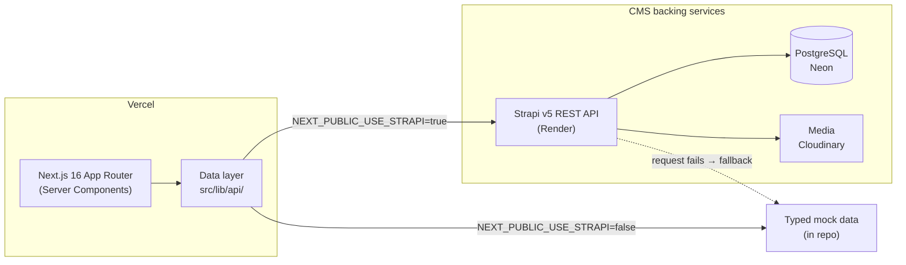

# 3legant Furniture Store

[](https://github.com/ngohuynhducdev/ecommerce/actions/workflows/ci.yml)

**🔗 Live demo: [ecommerce-dexr.vercel.app](https://ecommerce-dexr.vercel.app)**

A full-featured e-commerce storefront for a minimalist furniture brand, built with Next.js 16 App Router. Based on the [3legant Figma community design](https://www.figma.com/design/4wdIrC2NdJVK6VVFuWxtX7/).

> The live demo is served from the Strapi CMS (`NEXT_PUBLIC_USE_STRAPI=true`), with product content in Postgres and media on Cloudinary. Sign in with any email + a 6+ character password; card payments are simulated.


## Tech Stack

| Layer | Technology |
|---|---|
| Framework | Next.js 16 (App Router, Turbopack) |
| Language | TypeScript (strict mode) |
| Styling | Tailwind CSS v4 + shadcn/ui |
| State | Jotai + `atomWithStorage` (persisted to localStorage) |
| Forms | React Hook Form + Zod |
| Auth | NextAuth v5 (Credentials, mock authorize) |
| CMS | Strapi v5 (toggled via `NEXT_PUBLIC_USE_STRAPI`) |
| Testing | Vitest + happy-dom (unit) · Playwright (e2e) |
| Font | Poppins (Google Fonts) |

## Getting Started

```bash
# Install dependencies
yarn install

# Start the development server
yarn dev
```

Open [http://localhost:3000](http://localhost:3000) in your browser. No backend
is required — the app runs on in-repo mock data by default.

## Environment Variables

Create a `.env.local` file in the project root:

```env
# Auth (required)
AUTH_SECRET=your-secret-here

# Strapi CMS (optional — defaults to mock data)
NEXT_PUBLIC_USE_STRAPI=false
NEXT_PUBLIC_STRAPI_URL=http://localhost:1337
STRAPI_API_TOKEN=

# SEO (optional) — canonical origin for metadataBase / sitemap / robots
NEXT_PUBLIC_SITE_URL=http://localhost:3000
```

Generate `AUTH_SECRET` with:

```bash
openssl rand -hex 32
```

See `.env.example` for the annotated list.

## Project Structure

```
src/
├── app/                  # Next.js App Router pages
│   ├── page.tsx          # Homepage
│   ├── shop/             # Shop listing + product detail
│   ├── cart/             # Cart page
│   ├── checkout/         # Checkout form (contact, shipping, payment)
│   ├── order-success/    # Order confirmation
│   ├── account/          # Profile, addresses, orders, wishlist (protected)
│   ├── auth/             # Sign in / Sign up
│   ├── blog/             # Blog listing + post detail
│   ├── contact/          # Contact page
│   ├── api/              # NextAuth handler + coupon validation route
│   └── sitemap.ts, robots.ts, opengraph-image.tsx, error.tsx, not-found.tsx
├── components/ui/        # shadcn primitives (dialog, sheet, tabs, skeleton, sonner) + SafeImage
├── features/
│   ├── products/         # ProductCard, ImageGallery, FilterSidebar, types, mock data
│   ├── cart/             # CartFlyout, atoms
│   ├── wishlist/         # atoms
│   ├── checkout/         # step indicator, atoms, totals
│   ├── blog/             # BlogCard, BlogContent, TableOfContents, ShareButtons, mock data
│   ├── contact/          # ContactForm
│   ├── account/          # AccountSidebar
│   ├── auth/             # SignInForm, SignUpForm, AuthModal
│   └── shared/           # Navbar, Footer, Breadcrumb, AnnouncementBar, HeroCarousel
├── lib/
│   ├── api/              # products, categories, blog, coupons, strapi client
│   ├── site.ts           # canonical site config
│   └── utils.ts          # cn(), formatPrice(), generateOrderId()
├── auth.ts               # NextAuth config
└── middleware.ts         # protects /account/*
```

## Features

- **Shop** — product grid with a filter sidebar (category and price range), URL-param filters, sort, grid/list view toggle, show-more pagination
- **Product Detail** — image gallery with thumbnails, color and size variant selectors, quantity picker, Add to Cart, wishlist toggle, related products, tabbed Additional Info / Questions / Reviews
- **Cart** — quantity controls, coupon codes (`SAVE10`, `FURNITURE20`), order summary, persisted to localStorage
- **Checkout** — single page: contact details, shipping address and payment method on one validated form, with a sticky order summary carrying the cart's coupon and shipping method. A progress indicator runs across the three pages of the purchase journey — cart → checkout → order complete — ending on an animated order success page
- **Auth** — NextAuth v5 with a Credentials provider whose `authorize` accepts any email + password ≥ 6 chars (no user store, no OAuth provider); `/account` routes protected by middleware
- **Account** — profile and password form, saved billing/shipping addresses, order history (real orders from checkout, with sample rows until you place one), wishlist management
- **Blog** — featured post, article grid, full post with scroll-tracked table of contents, social share, related posts
- **Contact** — info cards, validated contact form, embedded Google map
- **SEO** — `generateMetadata` on product and blog detail pages (title, description and `og:image` from the content itself), static `metadata` on the other indexed routes, `generateStaticParams` for static generation, `sitemap.ts` + `robots.ts`. Transactional pages inherit the root metadata — `robots.ts` keeps them out of the index anyway
- **Performance** — ISR (`revalidate = 3600`) on the blog listing and posts; `/shop` renders on demand because it reads filter params, but its data fetches are cached for the same hour. Skeleton loading states and fade-in page transitions
- **Error handling** — global 404 / error pages, product-specific not-found

## Coupon Codes

| Code | Discount |
|---|---|
| `SAVE10` | 10% off |
| `FURNITURE20` | 20% off |

Coupons are validated server-side through `/api/coupons/validate`, so in Strapi
mode the codes are never readable from the browser.

## Testing

Unit tests run on [Vitest](https://vitest.dev) — **48 tests across 7 files**
covering the data layer (`lib/api` filtering, sorting, coupon validation),
Jotai atoms (cart totals, coupon and wishlist persistence), checkout totals,
and utilities. End-to-end tests run on [Playwright](https://playwright.dev) —
**4 specs** driving the full purchase flow (browse → product → cart with
coupon → checkout → order confirmation) plus empty-cart redirect and coupon
error paths. Both suites run in CI on every PR.

```bash
yarn test        # unit tests, run once
yarn test:watch  # unit tests, watch mode
yarn test:e2e    # e2e suite (builds and serves the app itself)
```

## Lighthouse

Production build (`next start`) on localhost, mobile emulation, default
Lighthouse throttling, running on mock data. Three runs per page; scores are
given as the range across those runs, because they move a few points run to
run.

| Page | Performance | Accessibility | Best Practices | SEO |
|---|---|---|---|---|
| Home | 81–83 | 100 | 100 | 100 |
| Shop | 80–86 | 100 | 100 | 100 |
| Product detail | 89–97 | 100 | 100 | 100 |
| Blog | 83–88 | 100 | 100 | 100 |
| Contact | 90–92 | 100 | 100 | 100 |

Accessibility, best practices and SEO sit at 100 on every public page.
Performance lands in the 80s–90s; the limiting factor is LCP under
Lighthouse's mobile throttling, since product and category photography is
hotlinked from Unsplash and Cloudinary rather than served from the app's own
origin.

Cart, checkout, order confirmation and account are deliberately excluded:
`robots.ts` disallows them, so Lighthouse scores their SEO as blocked —
which is the intended behaviour for transactional pages, not a defect.

## Data layer (mock ⇄ CMS)

The UI never talks to a data source directly — every read goes through
`src/lib/api/`, which switches on `NEXT_PUBLIC_USE_STRAPI`:

- **`false` (default)** — resolves from typed mock data in the repo. No
  network, no backend, instant. Every fetch also falls back to mock if a
  Strapi request fails, so the app never hard-breaks.
- **`true`** — fetches from a Strapi v5 REST API at
  `NEXT_PUBLIC_STRAPI_URL`, mapping Strapi's response shapes to the same
  domain types.

Because both paths return identical types, **switching sources requires
zero UI changes** — the components don't know where data comes from.



**The CMS is optional by design.** The live demo runs against Strapi, so
what you see at [ecommerce-dexr.vercel.app](https://ecommerce-dexr.vercel.app)
is real CMS content: products from Postgres (Neon), media from Cloudinary.
Strapi is called server-side only, so the API token never reaches the browser,
and `revalidate = 3600` keeps pages served from the ISR cache — which also
masks Render's free-tier cold start (measured at ~80 s from sleep). The Strapi
project — content types, controllers, seed content — lives in a separate repo:
[`ecommerce-cms`](https://github.com/ngohuynhducdev/ecommerce-cms).

Local development needs none of that: with `NEXT_PUBLIC_USE_STRAPI=false`
(the default) the app resolves everything from in-repo mock data, so
`yarn dev` works with no backend and no network.

## Screenshots

| Shop | Product detail |
|---|---|
|  |  |

| Cart (coupon applied) | Checkout |
|---|---|
|  |  |

<p align="center"></p>

## Deploy

### Vercel (recommended)

Import the repo at [vercel.com](https://vercel.com) — Next.js is
detected automatically. Set these environment variables:

| Variable | Value |
|---|---|
| `NEXT_PUBLIC_USE_STRAPI` | `false` to deploy on mock data, `true` to read from Strapi |
| `NEXT_PUBLIC_SITE_URL` | your Vercel URL (for `metadataBase` / sitemap) |
| `AUTH_SECRET` | `openssl rand -hex 32` |

With `NEXT_PUBLIC_USE_STRAPI=true` you also need `NEXT_PUBLIC_STRAPI_URL`
and a read-only `STRAPI_API_TOKEN` — that is how this project's own
deployment is configured. See `.env.example` for the full list.

### Self-hosted

```bash
yarn build
yarn start
```

## Development workflow

Built with an AI-assisted workflow, run with discipline: the project is
spec'd into phases with explicit coding rules (see `AGENTS.md`), each
phase is implemented on its own branch, and nothing merges without
review, tests (48 unit + 4 e2e), and green CI. AI accelerates the
typing — the architecture decisions (mock ⇄ CMS data layer, server-side
CMS calls to keep tokens out of the browser, token-gated coupon reads)
are deliberate and documented in this README.

Dependency policy: scheduled version-update PRs are off by choice;
Dependabot **security** updates stay on, and routine bumps are made by
hand so upgrades are reviewed rather than merged on a bot cadence.
